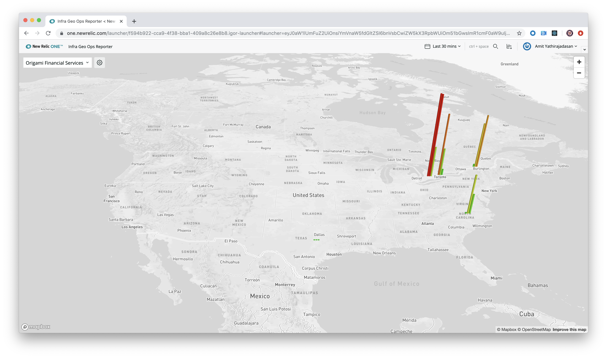
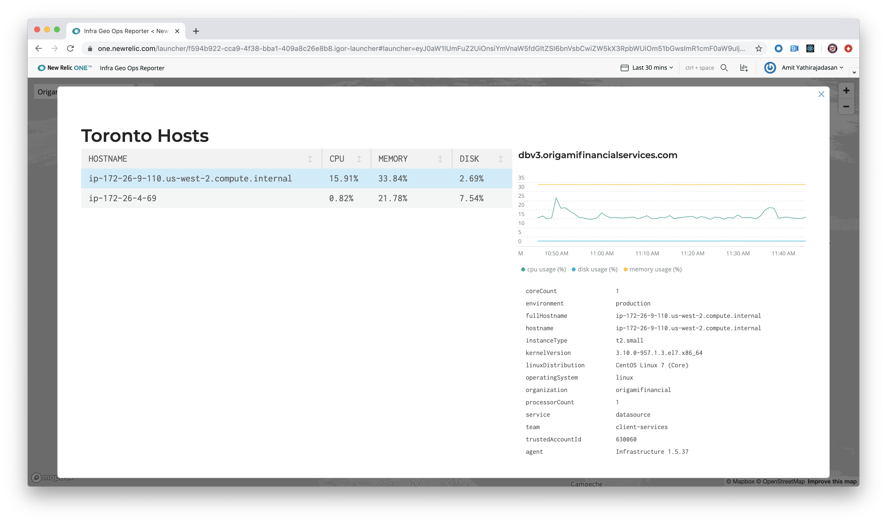
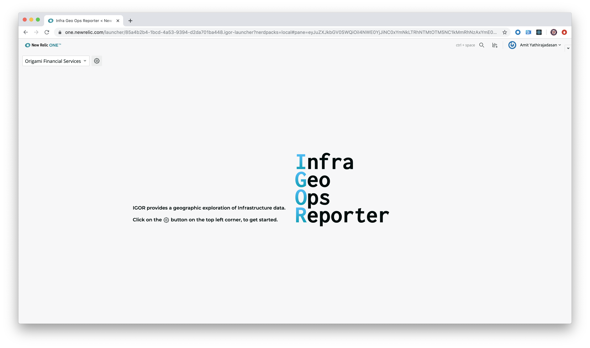
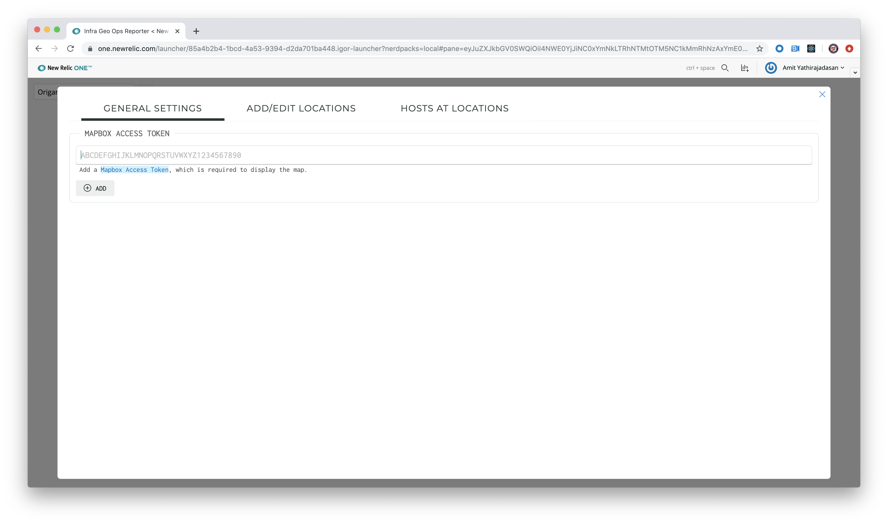
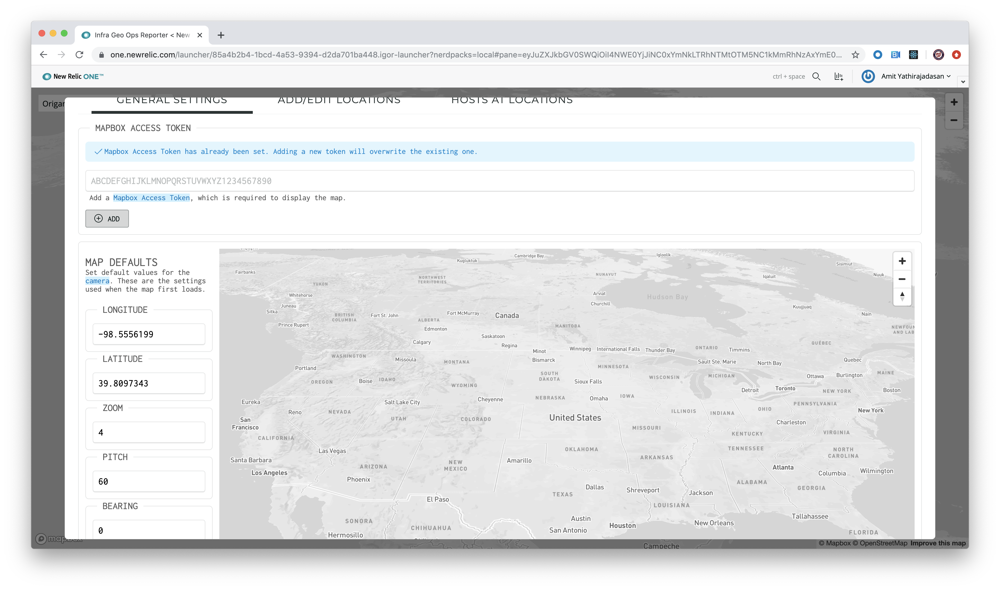
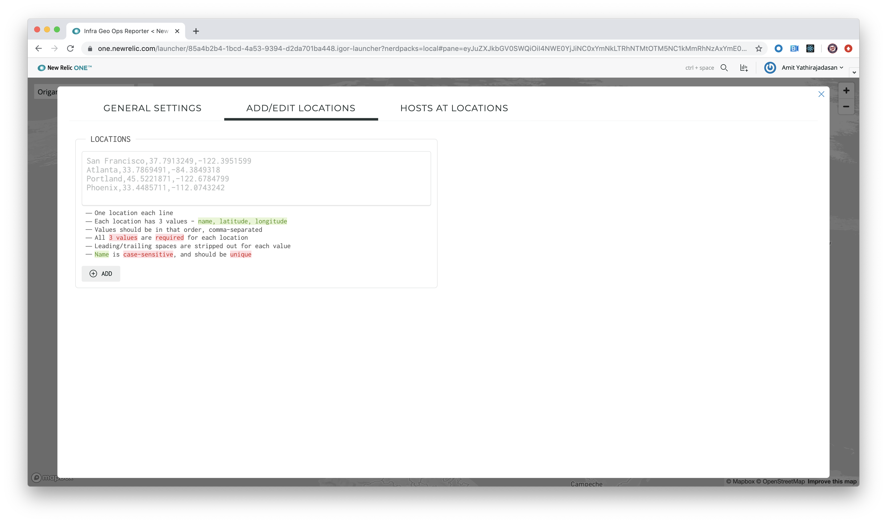
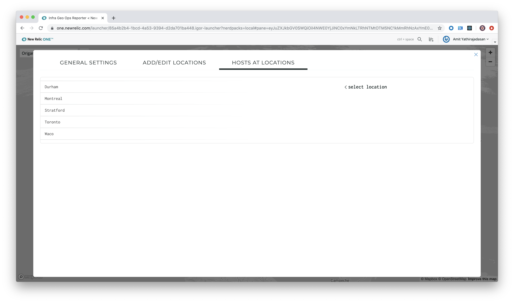

[](https://github.com/newrelic/open-source-office/blob/master/examples/categories/index.md#category-new-relic-experimental)

# New Relic One IGOR (Infrastructure Geo-Ops Reporter) (nr1-igor)

  [](https://snyk.io/test/github/newrelic-experimental/nr1-igor)

## Overview

IGOR (Infra Geo-Ops Reporter) overlays infrastructure data over a map view.



IGOR plots the highest CPU, memory, and disk usage for hosts at various locations on a map, with the ability to drill down into hosts at a location.



IGOR’s near real-time nature makes it ideal to be used in a network operations center.

## Open source license

This project is distributed under the [Apache 2 license](LICENSE).

## Dependencies

Requires [`New Relic Infrastructure`](https://newrelic.com/products/infrastructure).

## Getting started

1. Ensure that you have [Git](https://git-scm.com/book/en/v2/Getting-Started-Installing-Git) and [NPM](https://www.npmjs.com/get-npm) installed. If you're unsure whether you have one or both of them installed, run the following command. (If you have them installed these commands will return a version number, if not, the commands won't be recognized.)

   ```bash
   git --version
   npm -v
   ```

2. Install the [New Relic One CLI](https://one.newrelic.com/launcher/developer-center.launcher) by going to [this link](https://one.newrelic.com/launcher/developer-center.launcher) and following the instructions (5 minutes or less) to install and set up your New Relic development environment.

3. Run the following command to clone this repository and run the code locally against your New Relic data:

   ```bash
   nr1 nerdpack:clone -r https://github.com/newrelic/nr1-igor.git
   cd nr1-igor
   nr1 nerdpack:serve
   ```

Visit [https://one.newrelic.com/?nerdpacks=local](https://one.newrelic.com/?nerdpacks=local), navigate to the Nerdpack, and :sparkles:

## Deploying this Nerdpack

Open a command prompt in the nerdpack's directory and run the following commands.

```bash
# To create a new uuid for the nerdpack so that you can deploy it to your account:
# nr1 nerdpack:uuid -g [--profile=your_profile_name]

# To see a list of APIkeys / profiles available in your development environment:
# nr1 profiles:list

nr1 nerdpack:publish [--profile=your_profile_name]
nr1 nerdpack:deploy [-c [DEV|BETA|STABLE]] [--profile=your_profile_name]
nr1 nerdpack:subscribe [-c [DEV|BETA|STABLE]] [--profile=your_profile_name]
```

Visit [https://one.newrelic.com](https://one.newrelic.com), navigate to the Nerdpack, and :sparkles:

## Configuration

IGOR opens with a splash screen featuring a drop-down that lists accounts that you can switch between, and a button to open the admin panel.



### Set up Mapbox

1. Select the gear icon to open the admin panel.

   

2. IGOR uses Mapbox to display the map. To do so, in **General Settings**, add your **Mapbox Access Token**. For more information, see the [Mapbox access tokens](https://docs.mapbox.com/help/glossary/access-token/) information.

### Modify the default map view



1. Select the **Add/Edit Locations** tab to add locations on the map.

   

2. List the locations, one location per line, with the name, latitude, and longitude specified as comma-separated values for each location. For example:

   ```bash
   San Francisco,37.7913249,-122.3951599
   Atlanta,33.7869491,-84.3849318
   Portland,45.5221871,-122.6784799
   Phoenix,33.4485711,-112.0743242
   ```

3. After you add locations, switch to the **Hosts at Locations** tab.

   

4. Click on a location to bring up a list of hosts reporting into New Relic Infrastructure. Check all hosts for each location.

   

5. After you have set up all the locations, close the admin panel to view your map. :tada:

## Community Support

New Relic hosts and moderates an online forum where you can interact with New Relic employees as well as other customers to get help and share best practices. Like all New Relic open source community projects, there's a related topic in the New Relic Explorers Hub. You can find this project's topic/threads here:

[https://discuss.newrelic.com/t/nr1-igor-infrastructure-map-nerdpack/91886](https://discuss.newrelic.com/t/nr1-igor-infrastructure-map-nerdpack/91886)

Please do not report issues with IGOR to New Relic Global Technical Support. Instead, visit the [`Explorers Hub`](https://discuss.newrelic.com/c/build-on-new-relic) for troubleshooting and best-practices.

## Issues and enhancement requests

Submit issues and enhancement requests in the [Issues tab of this repository](../../issues). Please search for and review the existing open issues before submitting a new issue.

## Contributing

Contributions are welcome (and if you submit an enhancement request, expect to be invited to contribute it yourself :grin:). Please review our [contributors guide](CONTRIBUTING.md).

Keep in mind that when you submit your pull request, you'll need to sign the CLA via the click-through using CLA-Assistant. If you'd like to execute our corporate CLA, or if you have any questions, please drop us an email at opensource+nr1-igor@newrelic.com.
